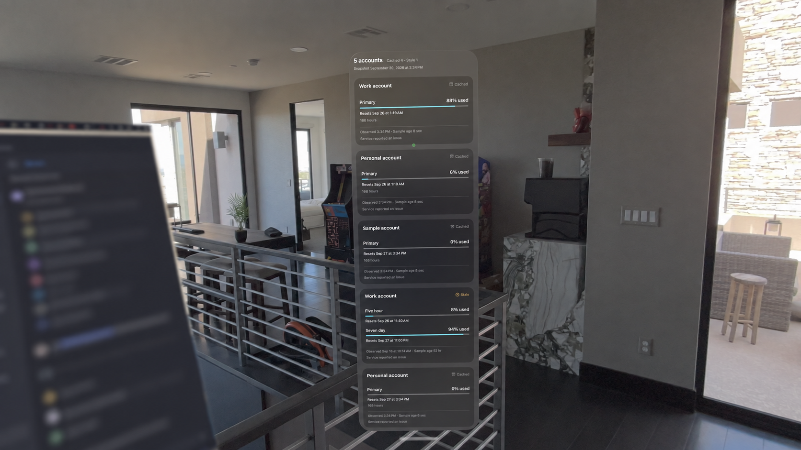
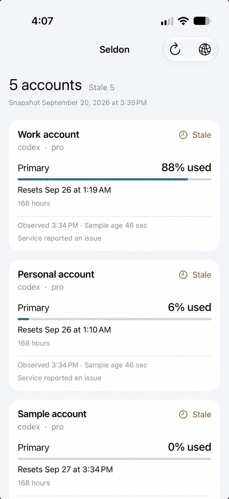

# Seldon

Seldon is a SwiftUI usage dashboard for iPhone and Apple Vision Pro. Configure a usage-server URL to view account quota utilization, reset times, source freshness, reported status, and server-provided usage runway in one quiet, readable panel.

The project uses shared SwiftUI models, services, state, design tokens, and views. It has separate iOS and visionOS app targets where platform-specific scene and navigation behavior differs.

## Preview

<p align="center">
  
</p>

<p align="center">
  
</p>

## Lachesis integration

Seldon is a visual client for [Lachesis](https://github.com/clickety-clacks/lachesis), the usage service that provides its normalized account, quota, and forecast snapshots. Configure Seldon with the reachable base URL for your Lachesis instance; it requests those snapshots from that address.

## What it shows

- Account labels, provider, and plan when reported by the server
- Per-window percentage used and reset time
- Source-reported status: Live, Cached, Stale, or Error
- Observation time, sample age, and snapshot summary
- Per-account runway from the server's observed history, with explicit collecting, exhausted, no-burn, reset-before-depletion, stale, unavailable, and authentication states
- Compact combined runway summaries for compatible provider, plan, window, and duration pools
- A compact card layout that expands into an aligned comparison panel when the window is wide enough

Percentages, usage bars, reset times, and source status stay visible beside each account's runway. Select an account for observation time, history coverage, and forecast explanations. Pool disclosures show members and the switching assumption without repeating each account's estimate.

Seldon presents the values supplied by the configured server. It does not calculate burn, create token estimates, combine incompatible quotas, collect history, or expose raw provider payloads. A combined runway assumes work can move between accounts in the same compatible pool.

## Platforms

- iOS 26 or later
- visionOS 26 or later

The iOS target uses a complete app icon. The visionOS target uses a layered app icon with an opaque background and transparent foreground.

## Configure a server

On first launch, choose **Configure Connection** and enter a reachable HTTP or HTTPS base URL. Seldon requests:

```text
GET /api/v1/usage
GET /api/v1/usage/forecast
```

The forecast endpoint is optional for older Lachesis servers. If it is unavailable, the current usage snapshot remains readable and Seldon removes the previous runway until a later refresh succeeds.

The configured URL stays on the device. Seldon does not include credentials, host discovery, connection profiles, or automatic network setup.

## Responsive interface

Seldon measures the available content width instead of choosing layouts by device model:

| Width | Layout |
| --- | --- |
| Under 680 pt | Single column of compact account cards |
| 680–1,039 pt | Two account-card columns |
| 1,040 pt and wider | Aligned account, usage, runway, and reset columns |

The visionOS window requests an initial 1,160 × 760 pt size and maintains a 420 × 420 pt content minimum. At accessibility text sizes, the interface uses one readable scrolling column.

## Build

1. Install Xcode with the iOS and visionOS SDKs.
2. Install [XcodeGen](https://github.com/yonaskolb/XcodeGen).
3. Generate and open the project:

   ```sh
   xcodegen generate
   open Seldon.xcodeproj
   ```

4. Select the iOS or visionOS scheme, configure your signing team, and run on a simulator or device.

The project declaration is in `project.yml`. Product views and shared code are in `Seldon/`; tests are in `SeldonTests/`.

## Architecture

- `Models`: normalized usage data safe for presentation
- `Services`: HTTP transport and local server-URL persistence
- `State`: observable dashboard state and manual refresh behavior
- `Design`: shared spacing, color, typography, and geometry tokens
- `Views`: adaptive iOS and visionOS projections of the shared state

See [the architecture notes](docs/architecture.md) and [the design specification](docs/design.md) for the complete implementation guidance.
